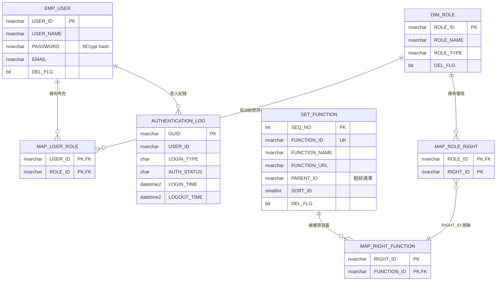
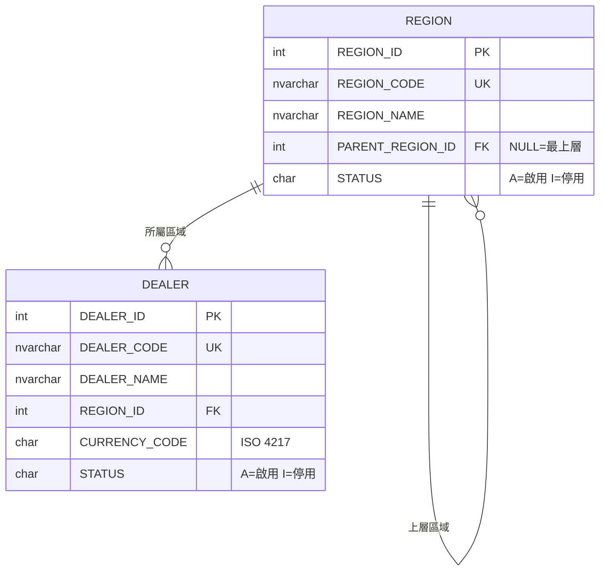
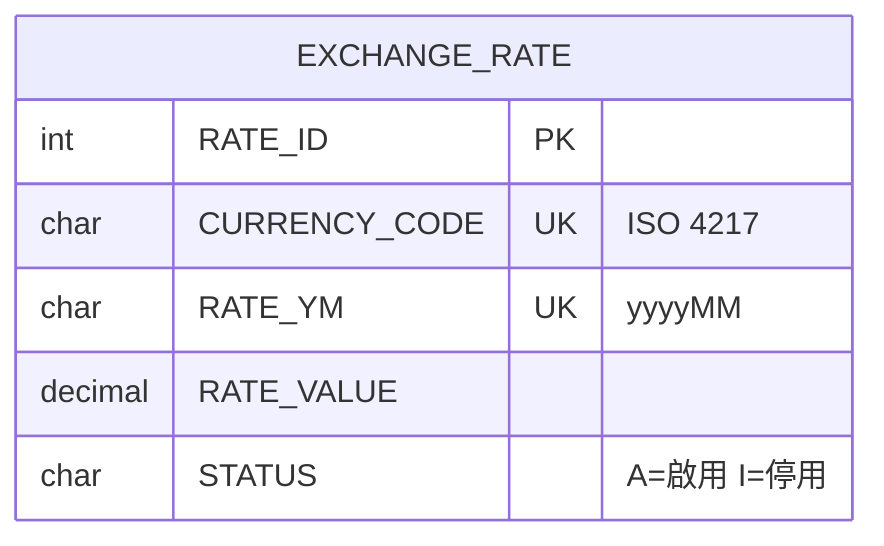
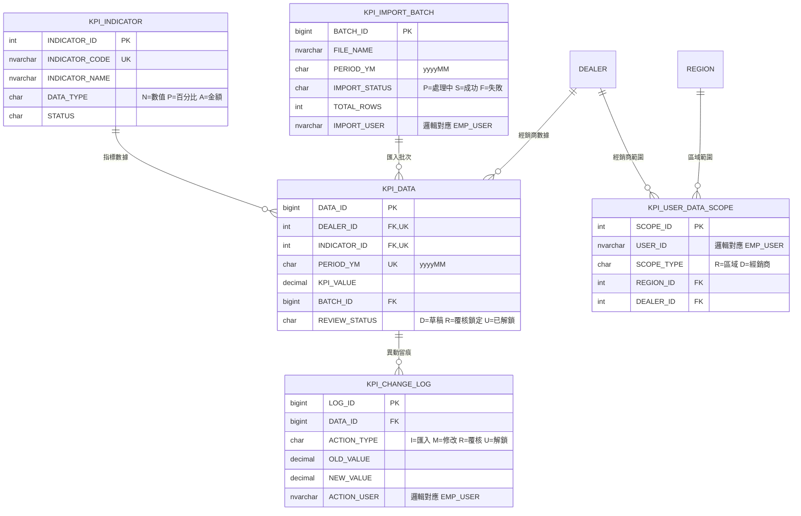

# DGPM_SPM

以 .NET 10 + Clean Architecture 為基礎的平台基礎服務，內建 Dapper 資料存取、Mapperly Source Generator、NLog 檔案日誌與完整的測試專案架構。安裝與設定方式見 [`docs/安裝文件.md`](docs/安裝文件.md)。

> **DGPM_SPM 起始基底**：保留範本的 Auth / Role / Permission / Parameter 示範功能；包含新架構 `Api` / `Core` / `Infrastructure` / `Web` 與測試專案（Core／Api／Architecture／Web／Integration），不包含範本的 legacy 專案。

> **Phase 3／帳號主責**：登入／帳號／角色／功能選單／登入歷程主責為 **PGM**（見姊妹專案 `d:\07-DGPM\PGM\docs\contracts\auth-consumer-contract.md`）。DGPM **不再支援** `AuthMode=Local` 與本地 Auth 維護；Auth 一律轉發 PGM。資料範圍定義見 PGM `docs/contracts/data-scope-emp-org.md`。部署參數見 [`docs/contracts/README.md`](docs/contracts/README.md)。

## 平台定位與接入邊界

`DGPM_SPM` 的長期定位是供新專案沿用的平台基礎，不以前一個既有專案的 domain 或資料庫結構作為永久規格。目前保留的是一組參照既有專案的 sample/compatibility integration，用來驗證平台能力可以接上既有系統。

- **通用平台能力**：Clean Architecture 引用方向、JWT 驗證（驗 PGM 簽發之票）、`ApiResponse<T>`、例外與 tracing middleware、Dapper `DbSession` / Unit of Work、分頁、Mapperly 與 Architecture Tests。
- **目前業務能力**：經銷商／區域／匯率／KPI 指標與匯入覆核／KPI 資料權限；Auth 一律經 `IPgmAuthClient` 轉發 PGM；功能權限檢核以 PGM menus 為真相。
- **已退役**：本地帳號／角色／功能選單／登入歷程維護（UI／API／Service／Seed）；`AuthMode=Local`。
- **新專案接入方式**：保留通用能力與分層鐵律，在 Core 依新 domain 定義介面與模型，在 Infrastructure 實作 repository / adapter，並於 `Api/IoC/ServiceDependencyInjection.cs` 明確註冊。Issuer、Audience、SecretKey 與 connection string 均由設定提供，不應寫死於程式碼。

目前這組既有專案參照示例與通用能力仍同在 Core / Infrastructure assembly；要形成可獨立發佈的平台套件，需另行決定 assembly 拆分及 API contract，不能以目錄搬移逕自完成。

---

## REST 端點（新 Api host）

| 方法 | 路徑 | 認證 | 說明 |
|---|---|---|---|
| POST | `/api/auth/login` | 匿名 | 轉發 PGM 登入，回傳 JWT + 選單 |
| POST | `/api/auth/logout` | Bearer | 轉發 PGM 登出 |
| POST | `/api/auth/refresh` | 匿名 | 轉發 PGM 刷新 token |
| GET | `/api/auth/me` | Bearer | 轉發 PGM 目前使用者資訊 |
| GET | `/api/auth/menus` | Bearer | 轉發 PGM 選單（側欄真相） |
| POST | `/api/auth/switch-role` | Bearer | 轉發 PGM 切換角色重簽 JWT |
| POST | `/api/auth/change-password` | Bearer | 轉發 PGM 改密 |
| GET | `/api/auth/permissions/{functionId}` | Bearer | 單一功能權限檢查（以 PGM menus） |
| POST | `/api/auth/permissions/batch` | Bearer | 批次功能權限檢查 |
| GET | `/api/parameters/{setItem}` | Bearer | 參數清單（6 小時 MemoryCache） |
| GET | `/api/dealers` | Bearer | 經銷商分頁查詢（keyword / regionId / status） |
| GET | `/api/dealers/{dealerId}` | Bearer | 經銷商明細 |
| POST | `/api/dealers` | Bearer | 建立經銷商 |
| PUT | `/api/dealers/{dealerId}` | Bearer | 編輯經銷商 |
| PUT | `/api/dealers/{dealerId}/status` | Bearer | 啟用 / 停用經銷商 |
| GET | `/api/kpi/indicators` | Bearer | KPI 指標分頁查詢（keyword / dataType / status） |
| POST | `/api/kpi/indicators` | Bearer | 建立 KPI 指標 |
| PUT | `/api/kpi/indicators/{indicatorId}` | Bearer | 編輯 KPI 指標 |
| PUT | `/api/kpi/indicators/{indicatorId}/status` | Bearer | 啟用 / 停用 KPI 指標 |
| GET | `/api/kpi/data-permissions/{userId}` | Bearer | 使用者 KPI 資料權限查詢（區域 / 經銷商範圍） |
| PUT | `/api/kpi/data-permissions/{userId}` | Bearer | 儲存使用者 KPI 資料權限（全量覆寫） |
| GET | `/api/health` | 匿名 | 健康檢查（Phase 0 骨架） |

---

## 目錄

- [快速開始](#快速開始)
- [專案結構](#專案結構)
- [分層規則](#分層規則)
- [技術選型](#技術選型)
- [資料庫設計（SDS 前暫定）](#資料庫設計sds-前暫定)
- [新增功能的 SOP](#新增功能的-sop)（前端選單／分頁見 [安裝文件：前端共用元件開發規範](docs/安裝文件.md#前端共用元件開發規範)）
- [測試](#測試)
- [設定與敏感資訊](#設定與敏感資訊)
- [已知不足與待辦](#已知不足與待辦)

---

## 快速開始

**需求：**
- .NET 10 SDK（新架構專案）
- SQL Server（本機或遠端皆可）

**執行新架構 Api（Phase 1）：**

```bash
# 還原套件
dotnet restore DGPM_SPM.slnx

# 設定 JWT SecretKey（必填，至少 32 字元；缺漏啟動即 throw）
cd Api
dotnet user-secrets init
dotnet user-secrets set "JwtSettings:SecretKey" "your-super-secret-key-min-32-characters-long"

# 設定 DB 連線（必填，Repository 查詢需要）
dotnet user-secrets set "ConnectionStrings:DefaultConnection" "Server=...;Database=...;TrustServerCertificate=True;..."

# 跑起來
dotnet run --project Api
```

**跑測試：**

```bash
dotnet test tests/Architecture.Tests           # 分層守護（六條規則 + Entity 命名）
dotnet test tests/Core.Tests                   # Core 單元測試
dotnet test tests/Api.Tests                    # Api Controller 單元測試
dotnet test tests/Web.Tests                    # Blazor 元件／導覽 helper（bUnit）
dotnet test tests/Integration.Tests            # 真實 DB 煙霧；無連線字串時需 DB 案例 Skip
```

Swagger UI 在 `http://localhost:5160/`（需 `EnableSwagger=true`；**目前預設關閉**）。

---

## 專案結構

```
DGPM_SPM/
├── Api/                              ⭐ 新架構應用進入點（net10.0）
│   ├── Controllers/                  Auth / Permission / Parameter / Health
│   ├── Middleware/                   全域例外處理、Tracing
│   ├── Infrastructure/               RequestContext、CurrentUser（HTTP 實作）
│   ├── IoC/                          DI 註冊集中處（attribute 掃描 + Repository）
│   └── Program.cs                    啟動組裝點（NLog、JWT 必填、Swagger）
│
├── Core/                             ⭐ 新架構業務核心：Domain + Application（net10.0）
│   ├── Domain/Entities/              User、Parameter、Dealer、Region、Kpi* 等（相容表 Entity 可能殘留未使用）
│   ├── Application/
│   │   ├── Interfaces/               IUnitOfWork、I*Repository、I*Service、IPgmAuthClient、ICurrentUser
│   │   ├── Models/                   Auth/Parameter/Kpi DTO、ApiResponse、ApiException
│   │   ├── Services/                 PermissionService、ParameterService、Dealer/Region/Kpi*
│   │   ├── Mapping/                  Mapperly Mapper
│   │   └── Queries/                  查詢用 Filter（含 FilterBase / PagedResult）
│   └── Common/
│       ├── Attributes/               DI 標記、MultiDescription
│       ├── Auth/                     AuthOptions（AllowPGMLoginEntry／PgmBaseUrl／SystemCode）
│       ├── Extensions/               靜態擴充方法
│       ├── Jwt/                      JwtSettings
│       └── Settings/                 EnvironmentSettings（env:name）
│
├── Infrastructure/                   ⭐ 新架構資料存取實作（net10.0，Dapper）
│   ├── Auth/                         PgmAuthClient
│   ├── Persistence/                  Connection Factory、DbSession、Dapper TypeMap
│   └── Repositories/                 User（精簡）／Parameter／業務 Repo + UnitOfWork
│
├── SQL/                              ⭐ DB Schema 腳本（SQL Server DDL，按 schema 分檔）
│   ├── README.md                     執行順序、rollback/變更原則、draft 邊界說明
│   ├── 00_create_schemas.sql         建立 org / cfg / kpi schema
│   ├── 10_dbo_qms_compat.sql         命名相容表（欄位反推；本機建表用）
│   ├── 20_org_master_data.sql        區域組織、經銷商（provisional draft）
│   ├── 30_cfg_system_parameters.sql  匯率參數（provisional draft）
│   ├── 40_kpi_dealer_kpi.sql         KPI 指標/數據/匯入/異動/資料權限（provisional draft）
│   └── 90_dev_seed_admin.sql         DGPM 開發種子（ADMIN + AshtonHsu；非正式 QMS）
│
├── tests/
│   ├── Core.Tests/                   Core 單元測試（xUnit + Shouldly + NSubstitute）
│   ├── Api.Tests/                    Api Controller 單元測試
│   ├── Architecture.Tests/           分層規則守護（NetArchTest，六條）
│   ├── Web.Tests/                    Blazor 元件測試（bUnit）
│   └── Integration.Tests/            真實 DB／E2E 煙霧（無連線字串則 Skip）
│
├── AGENT.md                          Cursor AI Agent 開發規範（最高規範）
├── docs/安裝文件.md                  安裝、設定與驗證證據
└── DGPM_SPM.slnx                     Solution 檔（新版 XML 格式）
```

---

## 分層規則

依賴方向由外向內單向流動，Core 是最內層，**不引用任何專案**。

```
┌──────────┐
│   Api    │  ─►  引用 Core、Infrastructure
└─────┬────┘
      ▼
┌──────────┐          ┌──────────────────┐
│   Core   │  ◀────── │  Infrastructure  │
└──────────┘          └──────────────────┘
   零 ProjectReference     引用 Core（實作 Core 的介面）
```

### 三條鐵律

1. **Core 不引用 Infrastructure。** Core 不知道有 SQL Server、Dapper、任何 ORM 存在。所有資料存取都是 Core 定義介面、Infrastructure 提供實作。
2. **Core 不引用 ASP.NET Core。** 沒有 `HttpContext`、沒有 `IActionResult`、沒有 `IHttpContextAccessor`。HTTP 是傳輸細節，屬於 Api 層。
3. **Domain Entity 用 PascalCase，跟 DB 欄位（SCREAMING_SNAKE_CASE）解耦。** 對應在 `Infrastructure/Persistence/DapperTypeMapConfig.cs` 集中處理。

> 守護測試會掃描 Core / Infrastructure / Api 三個 assembly；所有新程式碼都必須遵守上述鐵律。

### 這些規則怎麼守？（六條自動守護）

**自動守護** — `tests/Architecture.Tests/LayerDependencyTests.cs` 用 NetArchTest 掃 assembly 檢查依賴。CI 每次 build 都會跑，一違規立刻紅。

守護的規則包括：
1. Core 不引用 Infrastructure
2. Core 不引用 Api
3. Core 不引用 ASP.NET Core
4. Core 不引用 Dapper
5. Infrastructure 不引用 Api
6. `Core.Application.Interfaces` 介面命名以 `I` 開頭

---

## 技術選型

| 用途 | 選擇 | 為什麼 |
|---|---|---|
| Framework | ASP.NET Core (.NET 10) | 統一使用 net10.0 |
| ORM | **Dapper** | 輕量、SQL 掌控權完整；不用 EF Core 的重量與抽象成本 |
| Mapping | **Mapperly** | Source Generator，零 runtime cost；MIT，避免 AutoMapper 商業化問題 |
| 認證 | JWT Bearer | 標準無狀態方案 |
| 日誌 | **NLog** | 寫入 `C:\inetpub\logs\DGPM_SPM_{api|web}_yyyy-MM-dd.log`（Console + 檔案；App Pool 需寫入權限） |
| API 文件 | Swashbuckle (Swagger) | 事實標準 |
| 測試框架 | xUnit | .NET 最主流 |
| 架構測試 | NetArchTest.Rules | 用 fluent API 描述架構規則 |

### 已排除的選項與原因

- **Entity Framework Core**：與 Dapper 混用會造成心智負擔，選 Dapper 就不要 EF
- **AutoMapper 13+**：授權模式改變且效能不如 Source Generator（新 Core 專案禁止引用）

---

## 資料庫設計（SDS 前暫定）

> ⚠ **SDS（系統設計規格書）尚未到位。** 本章節除 `15_dbo_sysfun.sql` 的 `dbo.SysFun` 為 SA 提供的正式表腳本外，其餘 schema／物件說明多為依 sitemap 與既有需求推導的 **provisional draft（暫定草案）** 或命名相容定義，欄位與關係可能在 SDS 定稿後調整，不得視為正式規格。DDL 腳本與執行順序見 [`SQL/README.md`](SQL/README.md)。

### Schema 分區與邊界

| Schema | 定位 | 內容 |
|---|---|---|
| `dbo` | **既有系統相容／暫定混合區** | `dbo.SysFun` 由 `15_dbo_sysfun.sql` 提供正式定義；其餘使用者/角色/功能權限/參數/登入紀錄等物件，現階段多為本專案為相容既有系統而虛擬建立的最小定義，後續仍需依 SDS／實際來源校正 |
| `org` | provisional draft | 基本資料管理：區域組織、經銷商 |
| `cfg` | provisional draft | 系統參數管理：匯率參數 |
| `kpi` | provisional draft | 經銷商KPI管理：指標、匯入、數據、異動紀錄、資料權限 |

sitemap 各頁面與資料表的對應原則：查詢/流程頁（KPI異動紀錄查詢、KPI匯入日誌查詢、KPI數據覆核與解鎖）**重用**對應資料表，不另建表；經銷商儀錶板為 Qlik Cloud 外部整合，無核心業務表。登入／帳號／角色／功能選單／登入歷程維護與查詢已改由 **PGM** 主責；DGPM 種子不再維護這些選單項目，既有 DB 表預設保留（不 DROP）。

### 既有系統相容表與暫定物件（dbo）

下列 `dbo` 相容表結構仍可能存在於環境（供歷史資料／KPI 使用者對照），但 **DGPM 應用程式已不再走 Local Auth 登入或帳號／角色／功能維護路徑**。`dbo.SysFun` 使用 `15_dbo_sysfun.sql` 的正式定義，種子僅保留業務 Fun；PGM 主責項會軟刪。



通用鍵值參數表 `SET_PARAM`（`SET_ITEM` + `SET_TYPE` 複合鍵）為獨立查找表，無 FK 關聯，圖中省略。

### 基本資料管理（org — provisional draft）



### 系統參數管理（cfg — provisional draft）

匯率獨立成表（幣別 + 年月唯一）；其餘通用參數沿用既有 `dbo.SET_PARAM`。



### 經銷商KPI管理（kpi — provisional draft）

KPI 數據以「經銷商 × 指標 × 年月」唯一；覆核與解鎖走 `KPI_DATA.REVIEW_STATUS` 狀態欄位並在 `KPI_CHANGE_LOG` 留痕；`KPI_USER_DATA_SCOPE` 控制使用者可見的區域/經銷商範圍（KPI資料權限管理）。



> `USER_ID` 類欄位邏輯上對應 `dbo.EMP_USER.USER_ID`，但因既有 QMS 表非本專案所有，draft 階段不建跨 schema 實體 FK（詳見 `SQL/README.md`）。

### 待 SDS 確認的主要假設

- `org` / `cfg` / `kpi` schema 分區方式與命名。
- 區域組織是否需要樹狀階層（目前 `REGION.PARENT_REGION_ID` 支援）。
- 匯率是否按「幣別 + 年月」為粒度、是否需要買入/賣出等多匯率型別。
- KPI 數據粒度是否為「經銷商 × 指標 × 月」；覆核狀態機（草稿/覆核/解鎖）的實際流程。
- KPI 資料權限是否以「區域或經銷商」二擇一授權（目前 `SCOPE_TYPE` 設計）。
- `dbo` 既有 QMS 表的真實欄位型別與長度（目前為反推之推測值）。

---

## 新增功能的 SOP

與 ApiTemplate 完全相同，見 [`../API/README.md`](../API/README.md) 的「新增功能的 SOP」。摘要：

1. `Core/Domain/Entities/` 定義 PascalCase Entity（繼承 `BaseEntity`）
2. `Core/Application/Models/` + `Queries/` 定義 DTO 與 Filter（繼承 `FilterBase`）
3. `Core/Application/Interfaces/` 定義 `I{Xxx}Repository` / `I{Xxx}Service` / `I{Xxx}Mapper`
4. `Core/Application/Services/` + `Mapping/` 實作（掛 `[ScopedRegistration]` 自動註冊）
5. `Infrastructure/Repositories/` 實作 Repository（Dapper 呼叫帶 `_session.CurrentTransaction`）
6. `IUnitOfWork` 掛上新 Repository
7. `Api/IoC/ServiceDependencyInjection.cs` 註冊 Repository
8. `Infrastructure/Persistence/DapperTypeMapConfig.cs` 的 `MappedTypes` 加上新 Entity
9. `Api/Controllers/` 加 Controller（回傳 `ApiResponse<T>`）
10. `tests/Core.Tests/` 加測試

**前端共用元件（選單／分頁）：** 見 [`docs/安裝文件.md`](docs/安裝文件.md#前端共用元件開發規範)「前端共用元件開發規範」（`NavMenu`、`Pager` 的位置、參數、套用步驟與範例）。

---

## 測試

### 執行

```bash
dotnet test tests/Core.Tests                       # Core 單元測試
dotnet test tests/Api.Tests                        # Api Controller 單元測試
dotnet test tests/Architecture.Tests               # 只跑分層守護
dotnet test tests/Web.Tests                        # Blazor 元件測試
dotnet test tests/Integration.Tests                # 真實 DB 煙霧（無連線字串則 Skip）
dotnet test --filter "FullyQualifiedName~FilterBase"     # 特定測試
dotnet test tests/Core.Tests --collect:"XPlat Code Coverage"   # 帶 coverage
```

### 三種測試模式

**模式 1：純函式（Mapper / Extension）** — 直接 new 就能測（見 `EnumExtensionTests`）。

**模式 2：Service（需要 mock）** — NSubstitute mock 掉 UoW / Repository / Mapper，測業務邏輯與交易行為（Phase 1 遷移 AuthService 時採用）。

**模式 3：架構守護** — 直接掃 assembly，不用 arrange。

```csharp
Types.InAssembly(CoreAssembly)
    .Should().NotHaveDependencyOn("DGPM_SPM.Infrastructure")
    .GetResult().IsSuccessful.ShouldBeTrue();
```

---

## 設定與敏感資訊

### 開發環境：User Secrets

```bash
cd Api
dotnet user-secrets init
dotnet user-secrets set "JwtSettings:SecretKey" "..."
dotnet user-secrets set "ConnectionStrings:DefaultConnection" "..."
```

### 生產環境：環境變數或 Key Vault

**Never** 把敏感資訊寫進 `appsettings.json`。`SecretKey` 缺漏或短於 32 字元時啟動直接 throw（Phase 1 規範）。

---

## 已知不足與待辦

- **尚未執行真實 DB E2E**：本 Phase 以單元測試（mock UoW）與 build/architecture 守護驗證；需在本機設定 User Secrets 後手動 smoke test login / permissions / parameters。
- **`/api/auth/refresh` 未實作**：RefreshToken 不落地，永遠回 401。
- **所有環境強制密碼驗證**：新 Core 不沿用舊 QMS 在非 prod 繞過 BCrypt 的行為；SIT／開發／正式環境皆必須驗證密碼。
- **CPM（Central Package Management）**：`Directory.Packages.props` 統一 NuGet 版本，尚未導入。
- **Repository 整合測試**：Testcontainers + SQL Server，尚未導入。
- **Rate Limiter**：樣板有 per-IP Sliding Window，尚未啟用；Phase 2 評估。
