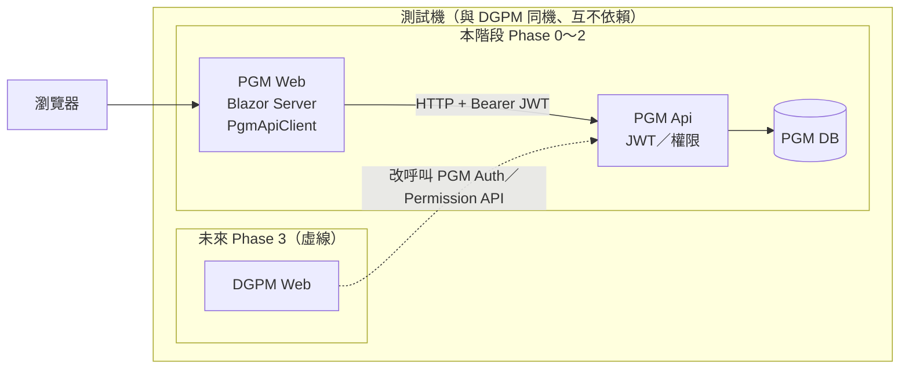
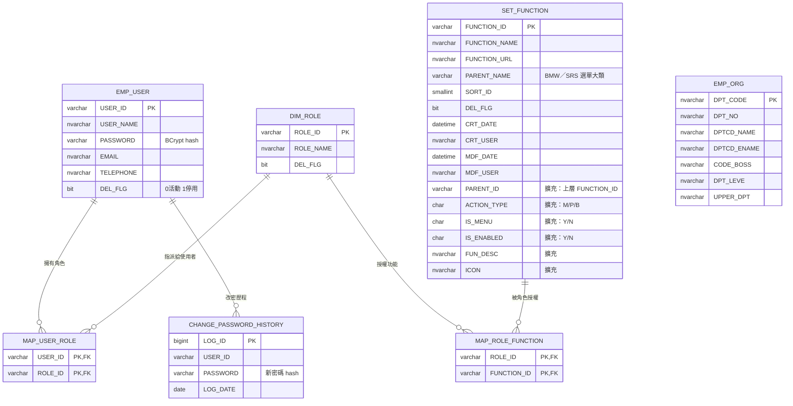
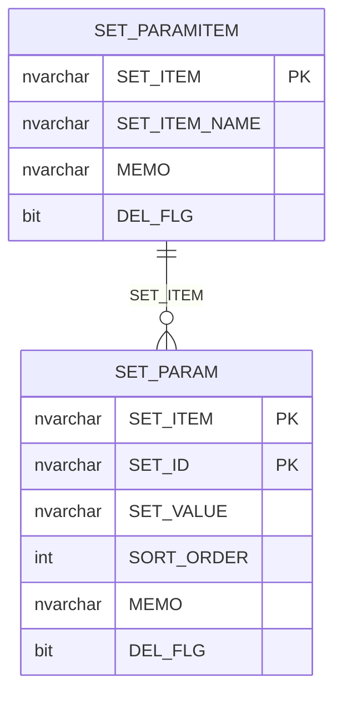

# PGM

以 .NET 10 + Clean Architecture 為基礎的**獨立權限／系統管理平台**（PGM），內建 Dapper、JWT、NLog 與測試專案。安裝見 [`docs/安裝文件.md`](docs/安裝文件.md)。

> **Agent 群**：開發代理請從 [`AGENTS.md`](AGENTS.md) 進入，並遵守 [`AGENT_CONSTITUTION.md`](AGENT_CONSTITUTION.md)、[`AGENT_IMPLEMENT.md`](AGENT_IMPLEMENT.md) 與 [`domain/`](domain/)。

> **PGM 起始基底**：Auth／Role／Permission／Parameter；方案含 `Api`／`Core`／`Infrastructure`／`Web` 與測試專案。功能主檔表為 **`SET_FUNCTION`**（BMW＋擴充欄），權限鏈為 `MAP_ROLE_FUNCTION`。

## 平台定位與接入邊界

`PGM` 的長期定位是供新專案沿用的平台基礎，不以前一個既有專案的 domain 或資料庫結構作為永久規格。目前保留的是一組參照既有專案的 sample/compatibility integration，用來驗證平台能力可以接上既有系統。

- **通用平台能力**：Clean Architecture 引用方向、JWT 建立與驗證、`ApiResponse<T>`、例外與 tracing middleware、Dapper `DbSession` / Unit of Work、分頁、Mapperly 與 Architecture Tests。
- **目前的既有專案參照能力**：`User` / `Role` / `Function` / `Parameter` / `AuthenticationLog` 模型、Auth / Permission / Parameter services，以及既有資料表相容的 SQL repositories。
- **新專案接入方式**：保留通用能力與分層鐵律，在 Core 依新 domain 定義介面與模型，在 Infrastructure 實作 repository / adapter，並於 `Api/IoC/ServiceDependencyInjection.cs` 明確註冊。Issuer、Audience、SecretKey 與 connection string 均由設定提供，不應寫死於程式碼。

目前這組既有專案參照示例與通用能力仍同在 Core / Infrastructure assembly；要形成可獨立發佈的平台套件，需另行決定 assembly 拆分及 API contract，不能以目錄搬移逕自完成。

**帳號主責＝PGM。** Phase 3 起 DGPM 可設 `AuthMode=PGM`，由 DGPM 登入頁呼叫 PGM Auth API（共用 JWT）；契約見 [`docs/contracts/auth-consumer-contract.md`](docs/contracts/auth-consumer-contract.md)。

部署架構見下圖（Web ↔ Api ↔ DB；DGPM 外連時改呼叫 PGM Api；可與 DGPM 同機）：



---

## REST 端點

| 方法 | 路徑 | 認證 | 說明 |
|---|---|---|---|
| POST | `/api/auth/login` | 匿名 | 登入，回傳 JWT + 選單 |
| POST | `/api/auth/logout` | Bearer | 更新 AUTHENTICATION_LOG 登出狀態 |
| POST | `/api/auth/refresh` | 匿名 | **尚未實作**（RefreshToken 不落地，回 401） |
| GET | `/api/auth/me` | Bearer | 目前使用者資訊 |
| GET | `/api/auth/menus` | Bearer | 目前角色選單 |
| GET | `/api/auth/permissions/{functionId}` | Bearer | 單一功能權限檢查 |
| POST | `/api/auth/permissions/batch` | Bearer | 批次功能權限檢查 |
| GET | `/api/parameters/{setItem}` | Bearer | 參數清單（6 小時 MemoryCache；BMW `SET_ID`） |
| GET | `/api/system/parameters/categories` | Bearer | ParamSet：活動中代碼類別（`SET_PARAMITEM`） |
| GET | `/api/system/parameters/{setItem}` | Bearer | ParamSet：依類別查 Grid |
| GET | `/api/system/parameters/{setItem}/next-sort-order` | Bearer | ParamSet：預設下一個排序 |
| POST | `/api/system/parameters` | Bearer | ParamSet：新增或復活代碼 |
| PUT | `/api/system/parameters/{setItem}/{setId}` | Bearer | ParamSet：編輯代碼名稱／排序 |
| DELETE | `/api/system/parameters/{setItem}/{setId}` | Bearer | ParamSet：軟刪 |
| GET | `/api/permission/function-list` | Bearer | 系統功能分頁查詢（來源 dbo.SET_FUNCTION） |
| GET | `/api/permission/function-list/{funId}` | Bearer | 系統功能明細 |
| GET | `/api/permission/function-list/parent-options` | Bearer | 查詢用上層選單（Action_Type=M） |
| GET | `/api/permission/function-list/options` | Bearer | 編輯用父節點下拉 |
| POST | `/api/permission/function-list` | Bearer | 建立系統功能 |
| PUT | `/api/permission/function-list/{funId}` | Bearer | 編輯系統功能 |
| DELETE | `/api/permission/function-list/{funId}` | Bearer | 軟刪 |
| GET | `/api/system/roles` | Bearer | 角色分頁查詢 |
| GET | `/api/system/roles/{roleId}` | Bearer | 角色明細 |
| POST | `/api/system/roles` | Bearer | 建立角色 |
| PUT | `/api/system/roles/{roleId}` | Bearer | 編輯角色 |
| PUT | `/api/system/roles/{roleId}/status` | Bearer | 啟用／停用角色 |
| GET | `/api/system/roles/{roleId}/permissions` | Bearer | 角色功能權限 |
| PUT | `/api/system/roles/{roleId}/permissions` | Bearer | 儲存角色功能權限 |
| GET | `/api/system/users` | Bearer | 使用者帳號分頁查詢 |
| GET | `/api/system/users/{userId}` | Bearer | 使用者帳號明細 |
| GET | `/api/system/users/role-options` | Bearer | 可指派的啟用角色 |
| POST | `/api/system/users` | Bearer | 建立帳號 |
| PUT | `/api/system/users/{userId}` | Bearer | 編輯帳號 |
| PUT | `/api/system/users/{userId}/status` | Bearer | 啟用／停用帳號 |
| GET | `/api/health` | 匿名 | 健康檢查 |

---

## 目錄

- [快速開始](#快速開始)
- [專案結構](#專案結構)
- [分層規則](#分層規則)
- [技術選型](#技術選型)
- [資料庫設計](#資料庫設計)
- [新增功能的 SOP](#新增功能的-sop)（前端選單／分頁見 [安裝文件：前端共用元件開發規範](docs/安裝文件.md#前端共用元件開發規範)）
- [測試](#測試)
- [設定與敏感資訊](#設定與敏感資訊)

---

## 快速開始

**需求：**
- .NET 10 SDK（新架構專案）
- SQL Server（本機或遠端皆可）

**執行新架構 Api（Phase 1）：**

```bash
# 還原套件
dotnet restore PGM.slnx

# 設定 JWT SecretKey（必填，至少 32 字元；缺漏啟動即 throw）
cd Api
dotnet user-secrets init
dotnet user-secrets set "JwtSettings:SecretKey" "your-super-secret-key-min-32-characters-long"

# 設定 DB 連線（必填，Repository 查詢需要）
dotnet user-secrets set "ConnectionStrings:DefaultConnection" "Server=...;Database=...;TrustServerCertificate=True;..."

# 跑起來
dotnet run --project Api
```

**跑測試：**

```bash
dotnet test tests/Architecture.Tests           # 分層守護（六條規則 + Entity 命名）
dotnet test tests/Core.Tests                   # Core 單元測試
dotnet test tests/Api.Tests                    # Api Controller 單元測試
dotnet test tests/Web.Tests                    # Blazor 元件／導覽 helper（bUnit）
dotnet test tests/Integration.Tests            # 真實 DB 煙霧；無連線字串時需 DB 案例 Skip
```

Swagger UI 在 `http://localhost:5160/`（需 `EnableSwagger=true`；**目前預設關閉**）。

---

## 專案結構

```
PGM/
├── Api/                              ⭐ 新架構應用進入點（net10.0）
│   ├── Controllers/                  Auth / Permission / Parameter / Health
│   ├── Middleware/                   全域例外處理、Tracing
│   ├── Infrastructure/               RequestContext、CurrentUser（HTTP 實作）
│   ├── IoC/                          DI 註冊集中處（attribute 掃描 + Repository）
│   └── Program.cs                    啟動組裝點（NLog、JWT 必填、Swagger）
│
├── Core/                             ⭐ 新架構業務核心：Domain + Application（net10.0）
│   ├── Domain/Entities/              User、Role、Function、Parameter、AuthenticationLog
│   ├── Application/
│   │   ├── Interfaces/               IUnitOfWork、I*Repository、I*Service、ICurrentUser
│   │   ├── Models/                   Auth/Parameter DTO、ApiResponse、ApiException
│   │   ├── Services/                 AuthService、TokenService、PermissionService、ParameterService
│   │   ├── Mapping/                  Mapperly AuthMapper、ParameterMapper
│   │   └── Queries/                  查詢用 Filter（含 FilterBase / PagedResult）
│   └── Common/
│       ├── Attributes/               DI 標記、MultiDescription
│       ├── Extensions/               靜態擴充方法
│       ├── Jwt/                      JwtSettings
│       └── Settings/                 EnvironmentSettings（env:name）
│
├── Infrastructure/                   ⭐ 新架構資料存取實作（net10.0，Dapper）
│   ├── Persistence/                  Connection Factory、DbSession、Dapper TypeMap
│   └── Repositories/                 User/Role/Menu/Parameter/AuthenticationLog + UnitOfWork
│
├── SQL/                              ⭐ DB Schema（BMW LIST＋SRS）
│   ├── README.md                     執行順序與權限鏈說明
│   ├── 10_dbo_pgm_tables.sql         LIST 九表（SET_FUNCTION 含 SysFun 擴充欄）
│   └── 90_dev_seed_admin.sql         開發種子（ADMIN＋MAP_ROLE_FUNCTION）
│
├── tests/
│   ├── Core.Tests/                   Core 單元測試（xUnit + Shouldly + NSubstitute）
│   ├── Api.Tests/                    Api Controller 單元測試
│   ├── Architecture.Tests/           分層規則守護（NetArchTest，六條）
│   ├── Web.Tests/                    Blazor 元件測試（bUnit）
│   └── Integration.Tests/            真實 DB／E2E 煙霧（無連線字串則 Skip）
│
├── AGENT_CONSTITUTION.md             Cursor AI Agent 開發規範（最高規範／憲法）
├── docs/安裝文件.md                  安裝、設定與驗證證據
└── PGM.slnx                     Solution 檔（新版 XML 格式）
```

---

## 三層式架構分層規則

依賴方向由外向內單向流動，Core 是最內層，**不引用任何專案**。

```
┌──────────┐
│   Api    │  ─►  引用 Core、Infrastructure
└─────┬────┘
      ▼
┌──────────┐          ┌──────────────────┐
│   Core   │  ◀────── │  Infrastructure  │
└──────────┘          └──────────────────┘
   零 ProjectReference     引用 Core（實作 Core 的介面）
```

### 三條鐵律

1. **Core 不引用 Infrastructure。** Core 不知道有 SQL Server、Dapper、任何 ORM 存在。所有資料存取都是 Core 定義介面、Infrastructure 提供實作。
2. **Core 不引用 ASP.NET Core。** 沒有 `HttpContext`、沒有 `IActionResult`、沒有 `IHttpContextAccessor`。HTTP 是傳輸細節，屬於 Api 層。
3. **Domain Entity 用 PascalCase，跟 DB 欄位（SCREAMING_SNAKE_CASE）解耦。** 對應在 `Infrastructure/Persistence/DapperTypeMapConfig.cs` 集中處理。

> 守護測試會掃描 Core / Infrastructure / Api 三個 assembly；所有新程式碼都必須遵守上述鐵律。

### 這些規則怎麼守？（六條自動守護）

**自動守護** — `tests/Architecture.Tests/LayerDependencyTests.cs` 用 NetArchTest 掃 assembly 檢查依賴。CI 每次 build 都會跑，一違規立刻紅。

守護的規則包括：
1. Core 不引用 Infrastructure
2. Core 不引用 Api
3. Core 不引用 ASP.NET Core
4. Core 不引用 Dapper
5. Infrastructure 不引用 Api
6. `Core.Application.Interfaces` 介面命名以 `I` 開頭

---

## 技術選型

| 用途 | 選擇 | 為什麼 |
|---|---|---|
| Framework | ASP.NET Core (.NET 10) | 統一使用 net10.0 |
| ORM | **Dapper** | 輕量、SQL 掌控權完整；不用 EF Core 的重量與抽象成本 |
| Mapping | **Mapperly** | Source Generator，零 runtime cost；MIT，避免 AutoMapper 商業化問題 |
| 認證 | JWT Bearer | 標準無狀態方案 |
| 日誌 | **NLog** | 寫入 `C:\inetpub\logs\PGM_{api|web}_yyyy-MM-dd.log`（Console + 檔案；App Pool 需寫入權限） |
| API 文件 | Swashbuckle (Swagger) | 事實標準 |
| 測試框架 | xUnit | .NET 最主流 |
| 架構測試 | NetArchTest.Rules | 用 fluent API 描述架構規則 |

### 已排除的選項與原因

- **Entity Framework Core**：與 Dapper 混用會造成心智負擔，選 Dapper 就不要 EF
- **AutoMapper 13+**：授權模式改變且效能不如 Source Generator（新 Core 專案禁止引用）

---

## 資料庫設計

> Schema 已依 BMW LIST（[`docs/BMWv20260720.xlsx`](docs/BMWv20260720.xlsx)／[`docs/BMWv20260720.md`](docs/BMWv20260720.md)）與四份 PGM SRS 定案。DDL 與執行順序見 [`SQL/10_dbo_pgm_tables.sql`](SQL/10_dbo_pgm_tables.sql)、[`SQL/_SQL_README.md`](SQL/_SQL_README.md)。少數尚未定案項目見章末 Open Questions，**不得**再視為「SDS 未到位的推導草稿」。

### 產品邊界與表清單（dbo）

本專案 PGM **僅**依四份 SRS 開立對應 Web UI：**Login**、**EMPSet**、**RoleFunctionSet**、**ParamSet**。  
本階段**不做**：`SET_FUNCTION`／`DIM_ROLE` 維護 UI、DGPM 改接 API、org／cfg／kpi 等業務 schema。

資料庫以 BMW LIST **九表**為準（全部 `dbo`）；功能主檔表名為 **`SET_FUNCTION`**（含 SysFun 語意擴充欄，**不建 SysFun 表**）。`EMP_ORG` 僅 DDL 預留、無維護 UI。

| 表 | UI／用途 |
|---|---|
| `EMP_USER` | Login／EMPSet |
| `EMP_ORG` | 僅 DDL 預留，無 UI |
| `DIM_ROLE` | EMPSet／RoleFunctionSet 讀取；無維護 UI |
| `MAP_USER_ROLE` | EMPSet（帳號×角色） |
| `SET_FUNCTION` | Login 選單／RoleFunctionSet 讀取；無維護 UI |
| `MAP_ROLE_FUNCTION` | RoleFunctionSet／Login 選單授權 |
| `SET_PARAMITEM` | ParamSet（參數類，畫面 R） |
| `SET_PARAM` | ParamSet（參數細項 CRUD） |
| `CHANGE_PASSWORD_HISTORY` | Login（改密／重設歷程） |

**權限鏈（SRS）：** `EMP_USER` → `MAP_USER_ROLE`／`DIM_ROLE` → `MAP_ROLE_FUNCTION` → `SET_FUNCTION`

### 帳號、角色與功能權限（dbo）

含權限鏈六表＋`EMP_ORG`（僅 DDL 預留：本階段無 UI、與 `EMP_USER` 無實體 FK，圖中獨立繪出）。參數兩表見下一節；合計 LIST **九表**（項次 1–6、8–10，**無第 7 項**）。



### 系統參數（ParamSet — dbo）

依 ParamSet SRS：`SET_PARAMITEM`（參數類）＋ `SET_PARAM`（細項，複合鍵 `SET_ITEM` + `SET_ID`）。與權限鏈無 FK；圖中獨立繪出。



### Open Questions（與本專案相關）

對齊 [`domain/`](domain/) 尚未定案項；細節與決策紀錄見各 `domain/*.md`。

- 與 QMS「同樣加密」：BCrypt Work factor／套件是否強制一致（**未定案前各自獨立**）。
- 預設密碼 `0000` 偵測：明文嘗試驗證 vs 專用旗標。
- Email／電話：BMW 可 NULL、SRS 畫面標必填 → 實作以何為準。
- `ACTION_TYPE='M'`（模組列）是否需一併授權，或僅授權葉功能 `P`。
- 新增帳號初始密碼：固定預設 `0000` hash 或管理者指定。

---

## 新增功能的 SOP

與 ApiTemplate 完全相同，見 [`../API/README.md`](../API/README.md) 的「新增功能的 SOP」。摘要：

1. `Core/Domain/Entities/` 定義 PascalCase Entity（繼承 `BaseEntity`）
2. `Core/Application/Models/` + `Queries/` 定義 DTO 與 Filter（繼承 `FilterBase`）
3. `Core/Application/Interfaces/` 定義 `I{Xxx}Repository` / `I{Xxx}Service` / `I{Xxx}Mapper`
4. `Core/Application/Services/` + `Mapping/` 實作（掛 `[ScopedRegistration]` 自動註冊）
5. `Infrastructure/Repositories/` 實作 Repository（Dapper 呼叫帶 `_session.CurrentTransaction`）
6. `IUnitOfWork` 掛上新 Repository
7. `Api/IoC/ServiceDependencyInjection.cs` 註冊 Repository
8. `Infrastructure/Persistence/DapperTypeMapConfig.cs` 的 `MappedTypes` 加上新 Entity
9. `Api/Controllers/` 加 Controller（回傳 `ApiResponse<T>`）
10. `tests/Core.Tests/` 加測試

**前端共用元件（選單／分頁）：** 見 [`docs/安裝文件.md`](docs/安裝文件.md#前端共用元件開發規範)「前端共用元件開發規範」（`NavMenu`、`Pager` 的位置、參數、套用步驟與範例）。

---

## 測試

### 執行

```bash
dotnet test tests/Core.Tests                       # Core 單元測試
dotnet test tests/Api.Tests                        # Api Controller 單元測試
dotnet test tests/Architecture.Tests               # 只跑分層守護
dotnet test tests/Web.Tests                        # Blazor 元件測試
dotnet test tests/Integration.Tests                # 真實 DB 煙霧（無連線字串則 Skip）
dotnet test --filter "FullyQualifiedName~FilterBase"     # 特定測試
dotnet test tests/Core.Tests --collect:"XPlat Code Coverage"   # 帶 coverage
```

### 三種測試模式

**模式 1：純函式（Mapper / Extension）** — 直接 new 就能測（見 `EnumExtensionTests`）。

**模式 2：Service（需要 mock）** — NSubstitute mock 掉 UoW / Repository / Mapper，測業務邏輯與交易行為（Phase 1 遷移 AuthService 時採用）。

**模式 3：架構守護** — 直接掃 assembly，不用 arrange。

```csharp
Types.InAssembly(CoreAssembly)
    .Should().NotHaveDependencyOn("PGM.Infrastructure")
    .GetResult().IsSuccessful.ShouldBeTrue();
```

---

## 設定與敏感資訊

### 開發環境：User Secrets

```bash
cd Api
dotnet user-secrets init
dotnet user-secrets set "JwtSettings:SecretKey" "..."
dotnet user-secrets set "ConnectionStrings:DefaultConnection" "..."
```

### 生產環境：環境變數或 Key Vault

**Never** 把敏感資訊寫進 `appsettings.json`。`SecretKey` 缺漏或短於 32 字元時啟動直接 throw（Phase 1 規範）。
