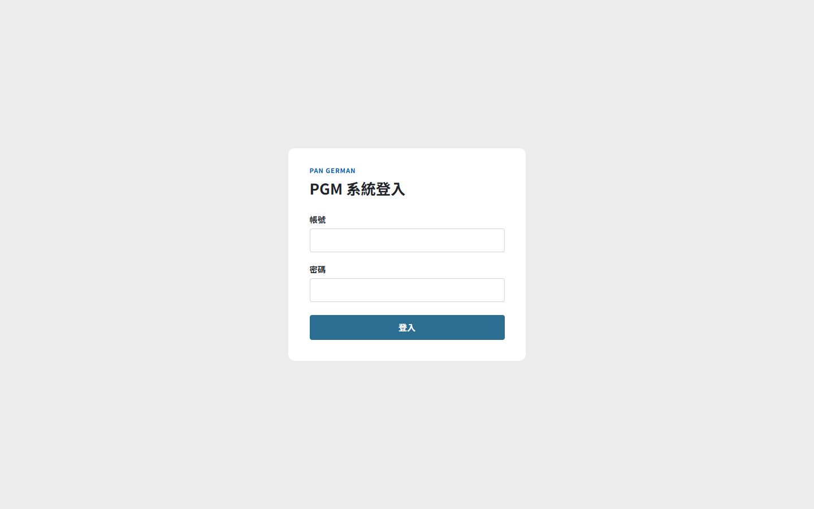
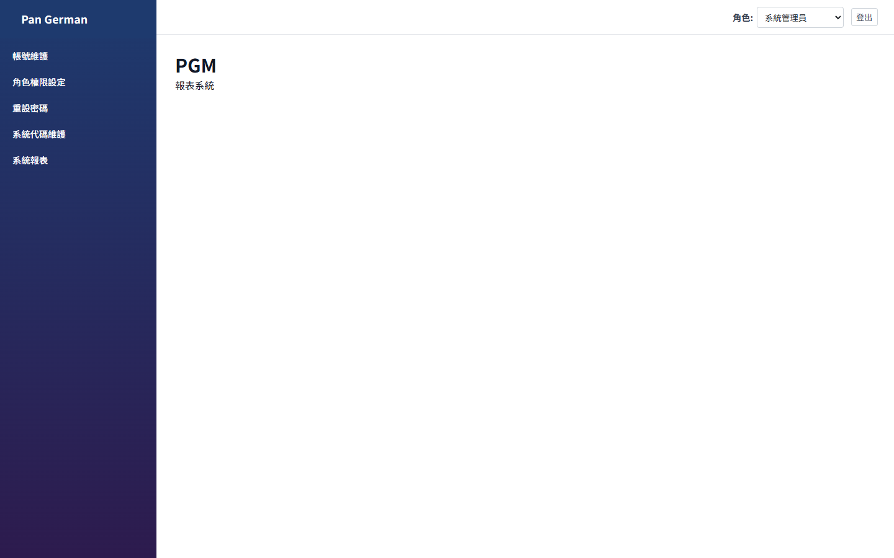
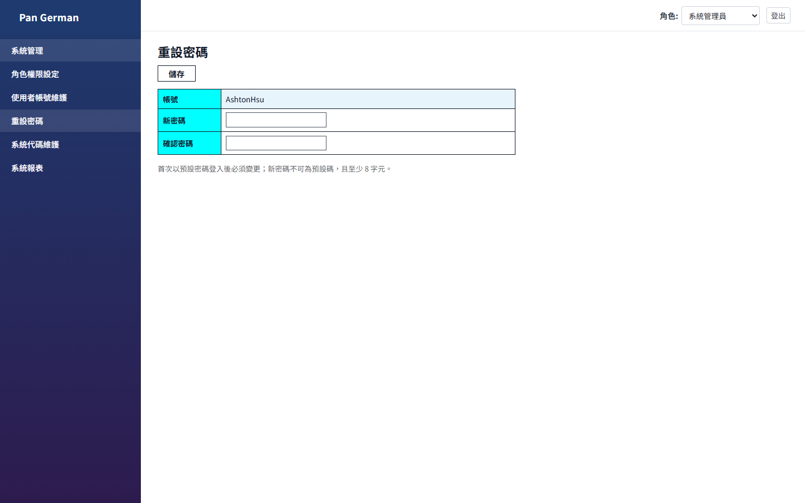
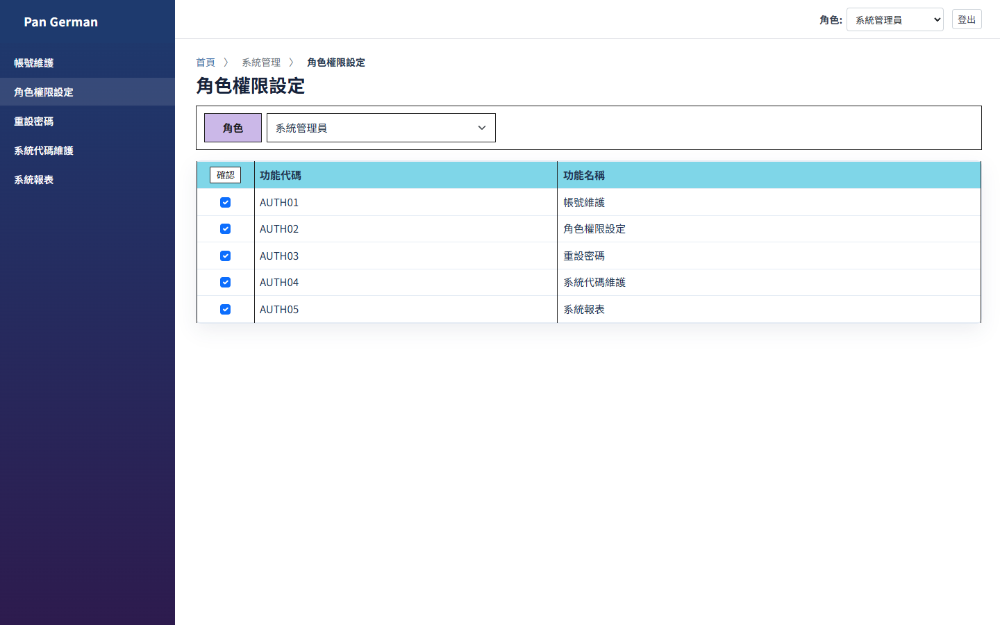
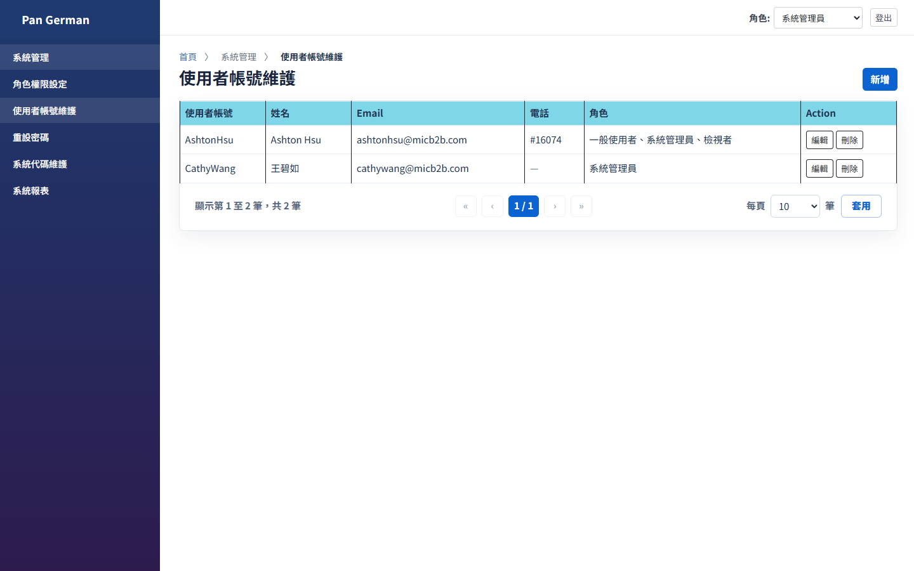
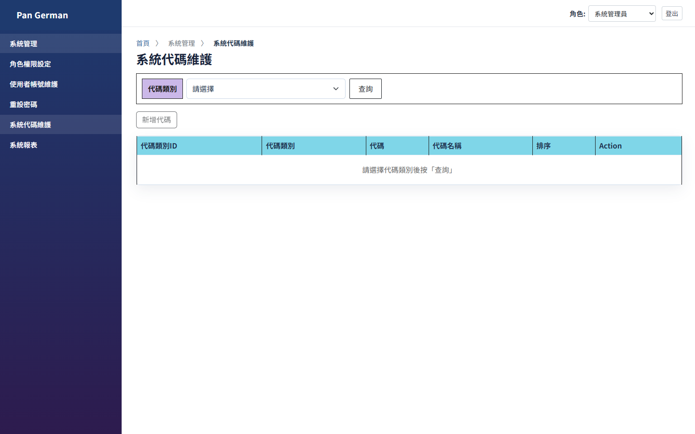
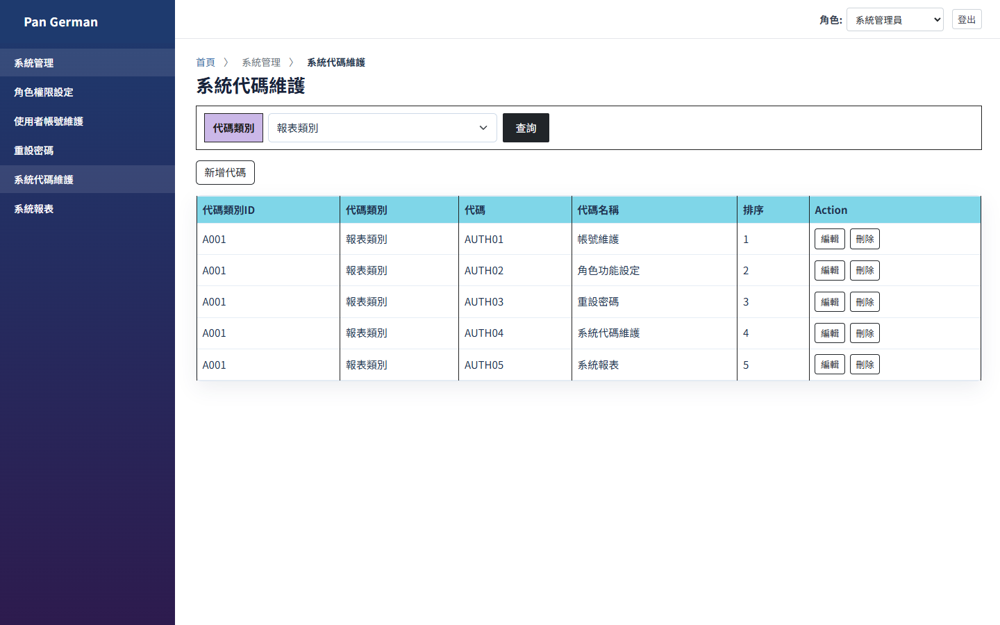
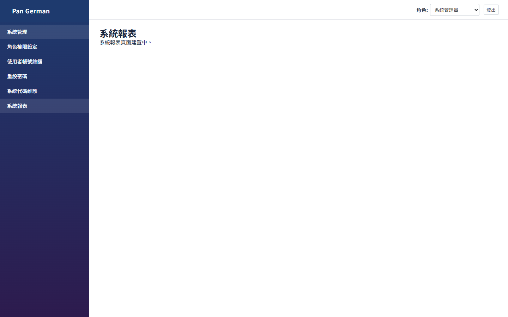
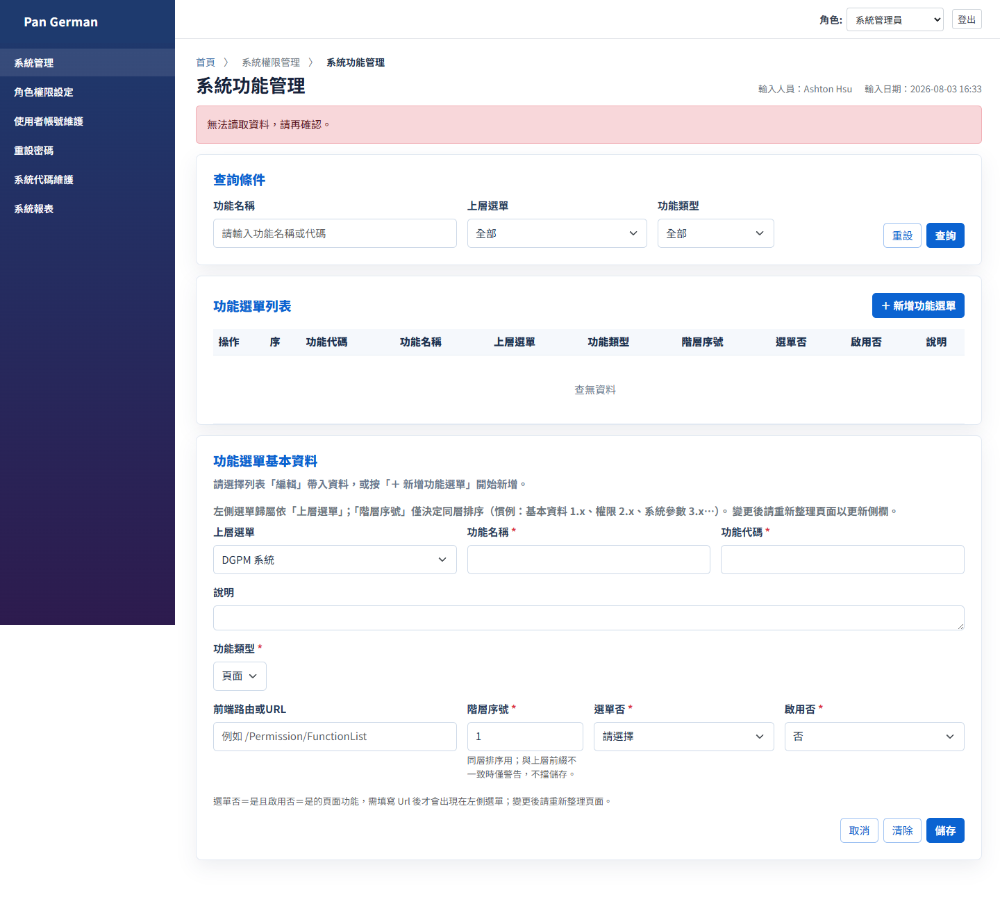
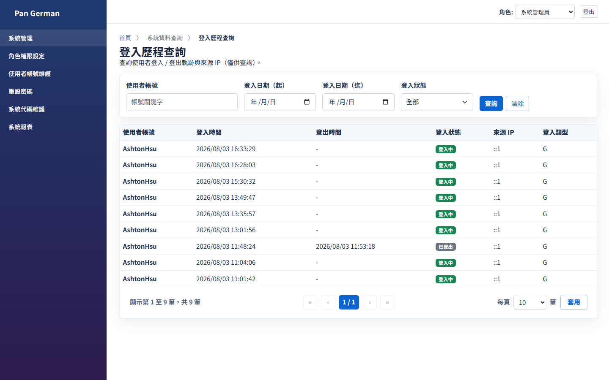

# PGM 使用說明

> 依四份 SA 規格（`docs/PGM_Qlik_*.docx`）與現行畫面整理。  
> 測試機入口：Web `http://localhost:8965`；Api `http://localhost:9528`（健康檢查：`/api/health`）。  
> 截圖日期：2026-08-03（角色＝系統管理員）。  
> 安裝／部署請另見 [安裝文件.md](../安裝文件.md)。

---

## 1. 系統簡介

PGM 為獨立權限／系統管理平台，依登入帳號擁有的**角色**決定左側選單與可操作功能。

本階段主要功能對應 SRS：

| 功能 | 選單名稱 | 路徑 | SRS |
|---|---|---|---|
| 登入／角色切換／重設密碼 | （登入頁／右上角色／重設密碼） | `/login`、`/account/change-password` | Login |
| 角色權限設定 | 角色權限設定 | `/system/roles` | RoleFunctionSet |
| 使用者帳號維護 | 使用者帳號維護 | `/system/users` | EMPSet |
| 系統代碼維護 | 系統代碼維護 | `/parameters/param-set` | ParamSet |
| 系統報表 | 系統報表 | `/reports` | （佔位，建置中） |

權限鏈：`EMP_USER` → `MAP_USER_ROLE`／`DIM_ROLE` → `MAP_ROLE_FUNCTION` → `SET_FUNCTION`。

---

## 2. 登入（Login SRS）

### 2.1 進入畫面

瀏覽器開啟 `http://localhost:8965` 進入登入頁（未登入會導向 `/login`）。

### 2.2 操作步驟

1. 輸入**帳號**、**密碼**（皆必填）。
2. 按 **登入**。

### 2.3 系統行為（與規格／產品定案一致）

| 情況 | 結果 |
|---|---|
| 帳密錯誤或帳號停用 | 提示帳號／密碼錯誤 |
| 帳號無任何角色 | 拒登，請管理員先設定角色 |
| 密碼為預設 `0000` | **強制改密**，導向重設密碼 |
| 登入成功 | 依帳號角色載入左側選單；右上顯示可切換角色 |

> **實作說明**：密碼以 BCrypt 驗證（不採納 Login SRS 範例之 SQL 明文比對）。開發帳密見 [安裝文件.md](../安裝文件.md)。

### 2.4 登入後首頁與角色切換

- 左側選單依**目前角色**授權顯示（對應 `SET_FUNCTION` ∩ `MAP_ROLE_FUNCTION`）。
- 右上 **角色** 下拉：切換 ROLE_ID 後重新載入選單，**不需重新登入**（Login SRS「角色切換」）。
- **登出**：結束工作階段。

---

## 3. 重設密碼（Login SRS §2.3）

### 3.1 進入方式

左側 **系統管理 → 重設密碼**，或首次以預設密碼登入時強制進入。

### 3.2 欄位與檢核

| 欄位 | 說明 |
|---|---|
| 帳號 | 唯讀，顯示目前登入者 |
| 新密碼 | 必填；不可為預設碼；至少 8 字元（實作） |
| 確認密碼 | 須與新密碼相同 |

1. 兩欄相同且通過檢核後按 **儲存**。
2. 新密碼不可與舊密碼相同。
3. 成功後寫入 `EMP_USER`，並紀錄 `CHANGE_PASSWORD_HISTORY`。

---

## 4. 角色權限設定（RoleFunctionSet SRS）

作業目的：依角色勾選可用功能，按 **確認** 時對 `MAP_ROLE_FUNCTION` **先刪後插（全量覆寫）**。  
`DIM_ROLE`／`SET_FUNCTION` 為只讀主檔（角色主檔由 IT／Seed／SQL 維護，本畫面不提供新增／編輯角色）。

### 4.1 進入畫面

左側 **角色權限設定**。

### 4.2 畫面功能與操作

1. **角色**：下拉選擇活動中角色（`DIM_ROLE` 且未停用）。
2. **Grid**：顯示全部未刪功能；欄位為勾選、**功能代碼**（系統代碼 `AUTH01`～`AUTH05`）、功能名稱。已授權者預設勾選。
3. **確認**（表頭按鈕）：
   - 必須已選角色
   - 允許全不勾選＝該角色無權限
   - 儲存時：`DELETE MAP_ROLE_FUNCTION WHERE ROLE_ID=…` 後，對勾選項 `INSERT`
4. 使用者改以該角色登入或切換角色後，選單立即反映。

> **注意**：勿勾選錯誤權限後儲存；建議重要角色變更前先備份 `MAP_ROLE_FUNCTION`。

---

## 5. 使用者帳號維護（EMPSet SRS）

### 5.1 進入畫面

左側 **使用者帳號維護**。

### 5.2 清單

顯示活動帳號欄位（對應 SRS Grid）：

| 畫面欄位 | 說明 |
|---|---|
| 使用者帳號 | `USER_ID` |
| 姓名 | `USER_NAME` |
| Email | `EMAIL` |
| 電話 | `TELEPHONE` |
| 角色 | 角色名稱聚合顯示 |
| Action | **編輯**／**刪除** |

### 5.3 新增

1. 按 **新增**。
2. 填寫必填：帳號、姓名、Email、電話、角色。
3. **儲存**：寫入 `EMP_USER`；角色寫入 `MAP_USER_ROLE`（先刪後插）。
4. 新增帳號預設密碼為 `0000`，首次登入須強制改密。

### 5.4 編輯

1. 按列上 **編輯**。
2. **使用者帳號**鎖定不可改；可改姓名、Email、電話、角色。
3. **儲存** 後角色對照同樣先刪後插。

### 5.5 刪除

1. 按 **刪除** 並確認。
2. 帳號軟刪（`DEL_FLG=1`），並清除該帳 `MAP_USER_ROLE`。

---

## 6. 系統代碼維護（ParamSet SRS）

### 6.1 進入與查詢

左側 **系統代碼維護**。先選**代碼類別**再按 **查詢**（類別來自 `SET_PARAMITEM`，畫面只讀、由 IT／SQL 維護）。

查詢後 Grid（`SET_PARAM`）：

| 畫面欄位 | 說明 |
|---|---|
| 代碼類別 ID／名稱 | 來自類別主檔 |
| 代碼 | `SET_ID` |
| 代碼名稱 | `SET_VALUE` |
| 排序 | `SORT_ORDER` |
| Action | **編輯**／**刪除** |

### 6.2 新增代碼

1. 先完成類別查詢，再按 **新增代碼**。
2. 類別自動帶入；填寫代碼、代碼名稱、排序（預設為下一排序，可改）。
3. **儲存**：
   - 同鍵已存在且活動中 → 提示重複
   - 同鍵已軟刪 → **復活**並更新值／排序
   - 否則新增

### 6.3 編輯／刪除

- **編輯**：代碼（`SET_ID`）不可改；可改名稱、排序。
- **刪除**：軟刪（`DEL_FLG=1`）；之後可用同代碼新增以復活。

---

## 7. 系統報表

選單 **系統報表** 目前為佔位頁（建置中）。

---

## 8. 其他已實作頁面（非本階段四份 SRS 主流程）

下列路由在程式中已存在，側欄是否顯示依功能主檔／授權而定；本手冊一併截圖備查。

| 畫面 | 路徑 | 截圖 |
|---|---|---|
| 系統功能列表 | `/system/functions` |  |
| 登入歷程查詢 | `/query/login-history` |  |

---

## 9. 常見問題

| 問題 | 建議處理 |
|---|---|
| 登入後選單很少 | 右上角色是否切到權限較少的角色？或該角色未在「功能權限」勾選 |
| 無法連線伺服器 | 確認測試機 Web／Api 可連：`http://localhost:8965`、`http://localhost:9528/api/health`（應回 `Healthy` 且 `database.connected=true`） |
| 忘記密碼 | 請管理員協助重置；或由有權限者協助處理帳號 |
| 預設密碼無法進系統 | 請依強制改密畫面變更密碼後再操作 |

---

## 10. 規格對照與範圍聲明

- 規格原件：`docs/PGM_Qlik_Login*.docx`、`EMPSet*.docx`、`RoleFunctionSet*.docx`、`ParamSet*.docx`、`BMWv*.md`。
- 領域規則補充：`domain/Login.md`、`EmpUser.md`、`RoleFunction.md`、`ParamSet.md`。
- 本階段**不做**：`SET_FUNCTION`／`DIM_ROLE` 維護 UI（功能／角色主檔以 Seed／SQL 為主）、DGPM 改接本平台 API。
