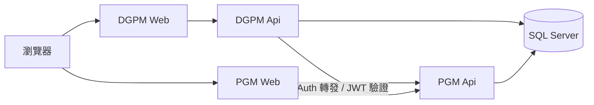

# DGPMwithPGM

作品集專案：**PGM（權限／系統管理平台）** + **DGPM_SPM（專案／經銷／KPI 業務系統）**。

兩者皆以 .NET 10 + Clean Architecture 實作；帳號、角色、功能授權由 **PGM** 主責，DGPM 透過 HTTP 轉發／共用 JWT 接入。

## 目錄結構

```text
DGPMwithPGM/
├── PGM/          # 權限平台（Auth / Role / Function / Parameter）
└── DGPM_SPM/     # 業務系統（經銷商、KPI…；Auth 轉發 PGM）
```

| 專案 | 說明 | 進入點 |
|------|------|--------|
| **PGM** | 獨立權限平台：JWT、角色、功能選單、登入歷程 | [`PGM/README.md`](PGM/README.md) |
| **DGPM_SPM** | DGPM 業務應用；登入／權限委派 PGM | [`DGPM_SPM/README.md`](DGPM_SPM/README.md) |

## 架構關係



## 技術棧

- **.NET 10**／ASP.NET Core／Blazor Server
- **Clean Architecture**：`Api` → `Core` ← `Infrastructure`（Core 零對外 ProjectReference）
- **Dapper**、**Mapperly**、**NLog**、**xUnit**、**NetArchTest**

## 亮點：PgmUiMode（系統權限 UI 可切換）

系統權限維護畫面不必綁死在單一前端：以 PGM `SET_PARAM`（`Auth`／`PgmUiMode`）驅動 **On／Off**。

| Mode | 行為 |
|------|------|
| **On** | 系統權限 UI 在 **PGM Web**（帳號、角色、功能、參數、登入歷程） |
| **Off** | 系統權限 UI 改掛在 **DGPM**：DGPM Api 轉發 PGM AUTH API，Web 提供 `SystemAuth/*` 頁面與頂列 Mode 切換 |

實作要點（作品集可對照程式）：

- **閘道**：`AuthMaintenanceGate`＋`RequireAuthFunction`——依 Mode、JWT `sys`、角色 MAP 決定可讀／可寫
- **選單**：`GET /api/auth/menus` 依 Mode 過濾 AUTH*／DGPM【系統管理權限】父層
- **API**：`GET/PUT /api/system/ui-mode`；AUTH09 `PUT .../reset-password` 代重設密碼
- **誰能切 Mode**：帳號掛 **PGMAdmin**（種子含 `Admin`、`AshtonHsu` 對齊同等權限；舊 `ADMIN` 角色亦認）
- **DGPM 轉發**：`IPgmAuthClient`／`PgmSystemForwardController` 代理 UiMode 與系統維護端點

契約說明見 [`PGM/docs/contracts/auth-consumer-contract.md`](PGM/docs/contracts/auth-consumer-contract.md)、[`DGPM_SPM/docs/contracts/README.md`](DGPM_SPM/docs/contracts/README.md)。

## 本機快速開始（摘要）

詳見各子專案 README／安裝文件。典型流程：

1. 準備 SQL Server，套用 `PGM/SQL`、`DGPM_SPM/SQL` 腳本  
2. 設定 User Secrets（JWT SecretKey ≥ 32、ConnectionString）  
3. 先啟動 **PGM Api／Web**，再啟動 **DGPM Api／Web**  
4. 以 PGM 建立帳號／角色／功能後，從 DGPM 登入（系統代碼 `DGPM`）  
5. 以 PGMAdmin 帳號切換 PgmUiMode，驗證系統權限 UI 歸屬 PGM 或 DGPM

## 安全說明（作品集版）

本倉庫已移除真實密碼、JWT Secret 與內網連線字串；`web.config`／Production 設定改為占位符。請以環境變數或 User Secrets 填入自己的值，**勿**把真實密鑰提交回公開 repo。

## License

MIT（若 GitHub 倉庫已附加授權檔，以其為準）
